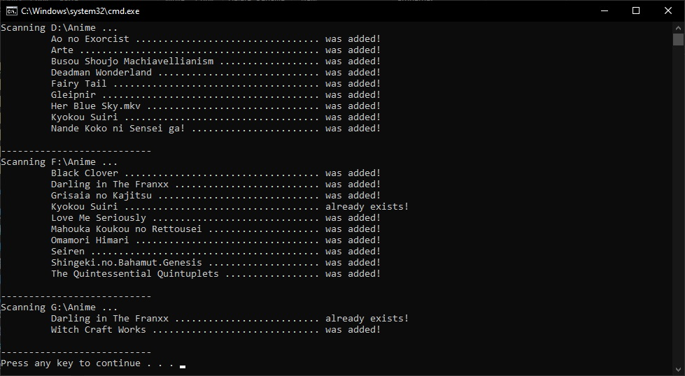

# Local-Anime-Indexer
A simple php based anime indexer. This indexer is delevope with windows os in mind and hosted an xamp server. Indexer searches each drive letter for path specified in config and then list all directory files and forlder as a anime. Then by each file name do search on MAL and pick first item from result and get info and cover picture from it, It also do a query on Jikan api to get extra information about anime.

# Config
At first set the relative anime path in each drive by settin `DRIVE_SEARCH_SUB_DIR` in `config.php`.

# Indexer
You should run the indexer by running `run-indexer.bat`. The console output should be like this:

# Open Anime Directory In Windows Explorer
I add a protocol handler to open windows exprlorer by click on path of anime directory. To get it working you should run registery patch file `Explore Protocol Handler.reg`.

# Database
All the data records store in a sqllight database next to project named `data.db`. Indexer truncate data table before run.